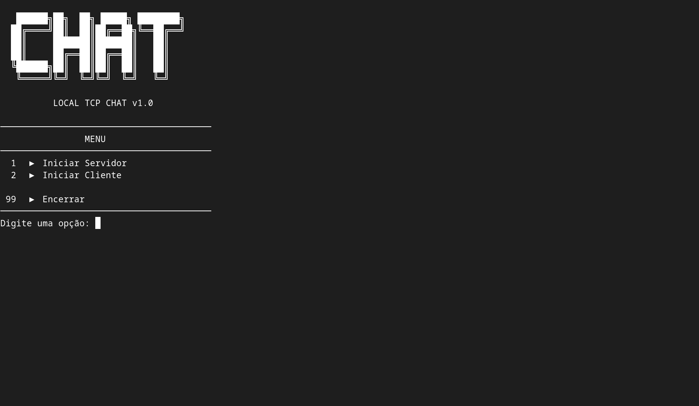

````markdown
# ByteChat
````


````markdown
**ByteChat** é uma ferramenta de chat TCP **peer-to-peer** para redes locais (LAN), desenvolvida em Python.  
Inspirado no conceito minimalista do Netcat, permite comunicação direta entre cliente e servidor sem necessidade de internet, com **autenticação opcional por senha**.

> Comunicação simples. Direta. Sem intermediários.

---

## ✨ Features

- Modos **Servidor** e **Cliente**
- Comunicação **TCP via LAN**
- **Autenticação opcional por senha**
- Interface simples em **terminal (CLI)**
- Projeto **educacional**, ideal para aprender sobre sockets em Python

---

## 🛠 Requisitos

- Python **3.x**
- Sistema operacional com suporte a **TCP sockets**
- Linux/Unix recomendado (funciona em Windows, mas com ajustes mínimos)

---

## 🚀 Como Usar

### 1. Clonar o repositório

```bash
git clone https://github.com/seuusuario/ByteChat.git
cd ByteChat
````

```

### 🔹 O que muda com HTML:

- `<p align="center">` → centraliza a imagem e badges.  
- `` → força a largura da imagem e evita que quebre o layout.  
- Markdown normal continua funcionando abaixo da imagem.  

Quer que eu faça isso?
```
